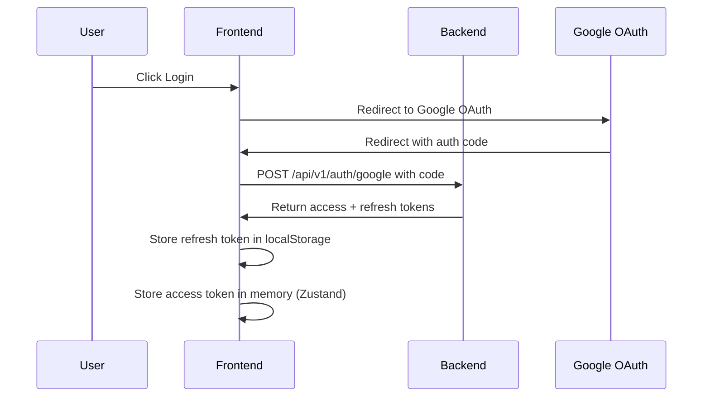
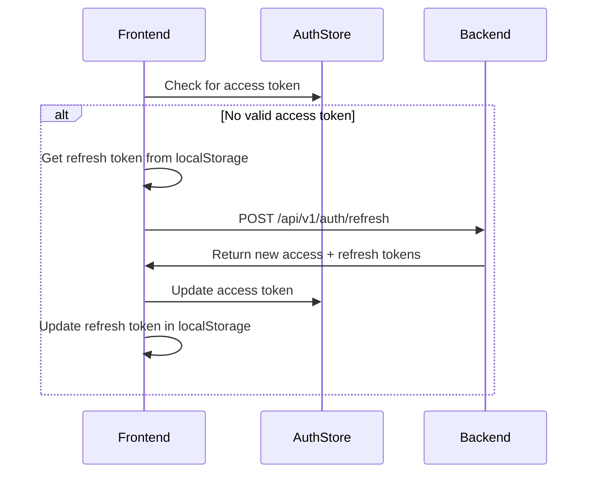
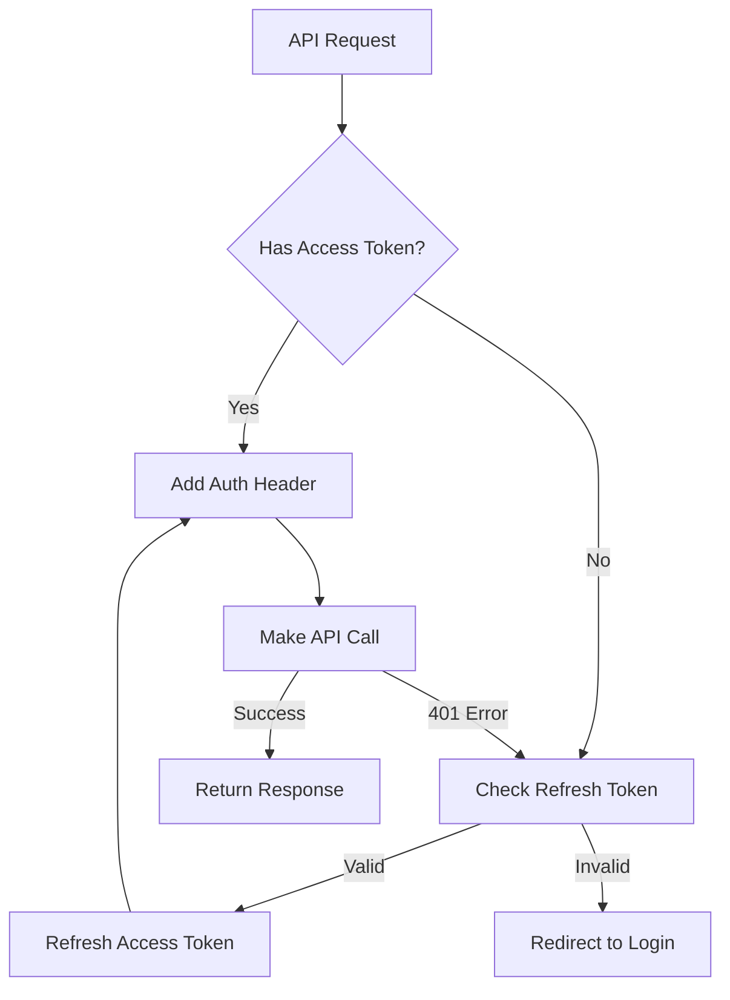

# API Authentication Documentation

## Overview
This document describes the authentication system implementation, including the token refresh mechanism and API client setup.

## Authentication Flow



## Token Refresh Flow



## Authentication Flow Details

### User ID Format
- Users are identified with a `google_[id]` format (e.g., `google_104867484133403442453`)
- This prefix is added during initial user creation
- The same prefixed ID is used consistently in:
  - KV storage keys
  - JWT tokens (`sub` claim)
  - API responses

### Token Refresh Process
1. Frontend stores refresh token in localStorage
2. On page load, AuthContext checks for refresh token
3. If found, calls `/api/v1/auth/refresh` endpoint
4. Backend validates refresh token and extracts user ID
5. Looks up user in KV storage using ID from token
6. Returns new access/refresh tokens and user data

### Security Measures
- Access tokens stored only in memory (Zustand store)
- Refresh tokens stored in localStorage
- Automatic token refresh with request queueing
- Centralized API client with interceptors

### Planned Improvements



## Implementation Details

### 1. Centralized API Client
We will create a single Axios instance with:
- Base URL configuration
- Default headers
- Request/response interceptors
- Automatic token management

```typescript
// Simplified example of the improved api.ts
const api = axios.create({
  baseURL: import.meta.env.VITE_API_URL,
  withCredentials: true
});

// Add auth header automatically
api.interceptors.request.use((config) => {
  const token = useAuthStore.getState().accessToken;
  if (token) {
    config.headers.Authorization = `Bearer ${token}`;
  }
  return config;
});

// Handle token refresh
api.interceptors.response.use(
  (response) => response,
  async (error) => {
    if (error.response?.status === 401) {
      try {
        await authService.refreshToken();
        // Retry original request
        return api(error.config);
      } catch {
        // Refresh failed, redirect to login
        authService.logout();
      }
    }
    return Promise.reject(error);
  }
);
```

### 2. Authentication Store
The Zustand store manages:
- Access token (in-memory)
- User data
- Authentication state
- Loading states

### 3. Token Storage
- Access Token: Stored in memory (Zustand store)
- Refresh Token: Stored in localStorage
- Clear separation of concerns for token management

## Future Improvements
1. Consider implementing token rotation for refresh tokens
2. Add rate limiting for token refresh attempts
3. Implement token blacklisting on the backend
4. Add token expiry tracking to optimize refresh timing
