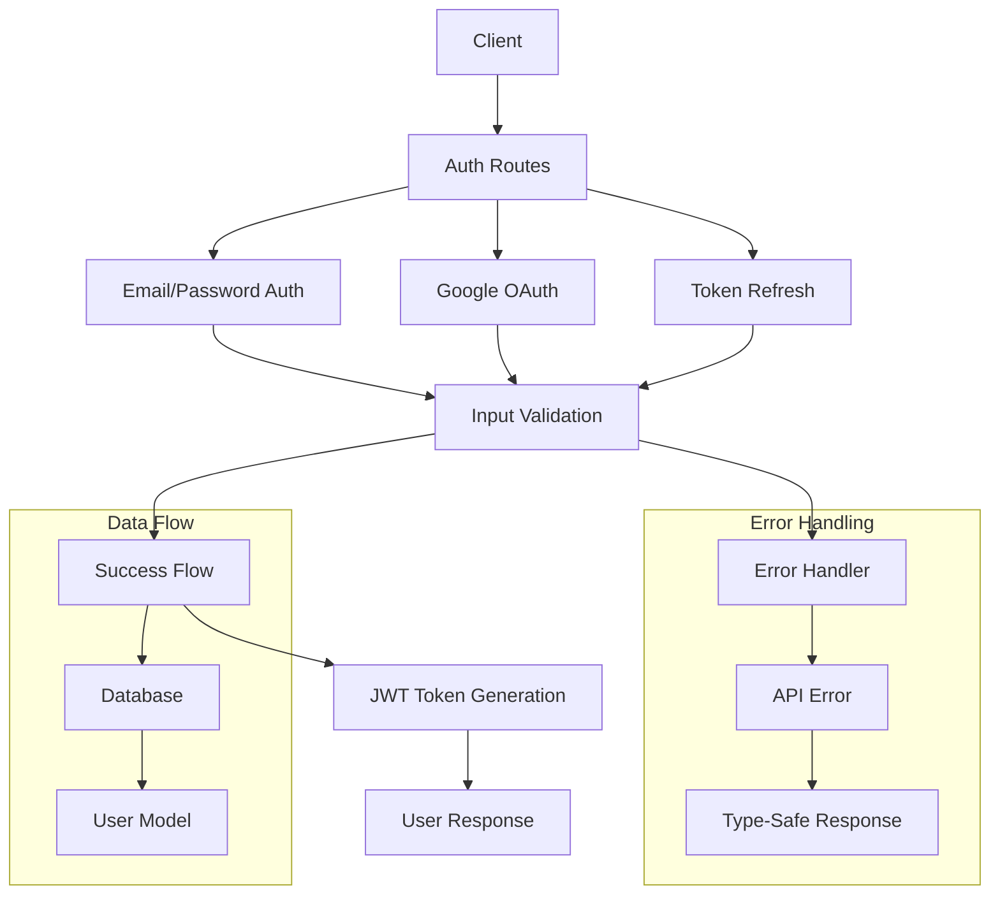
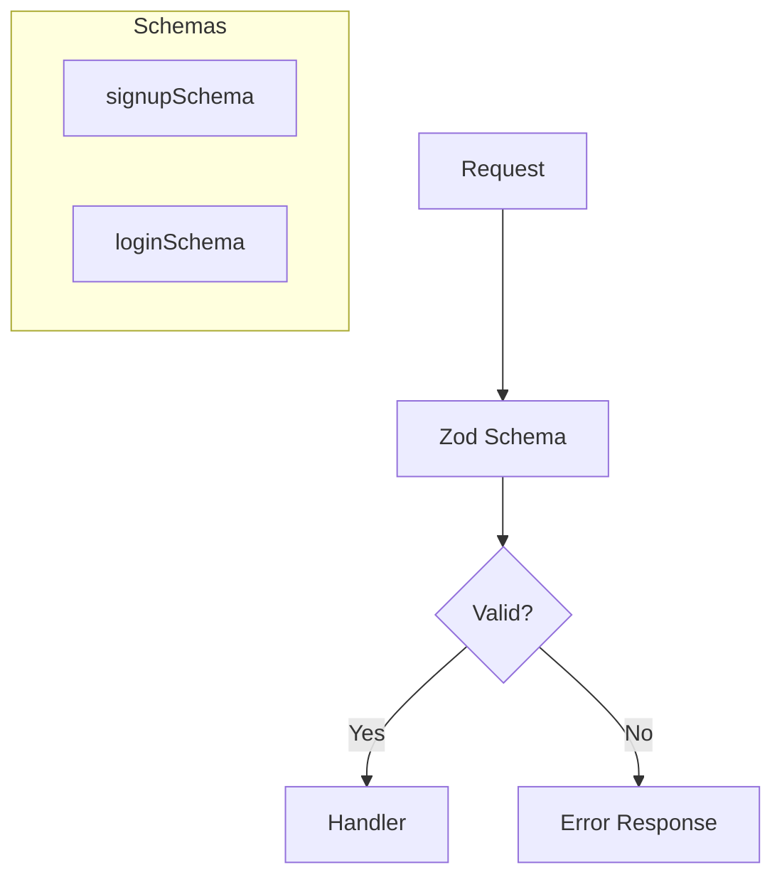
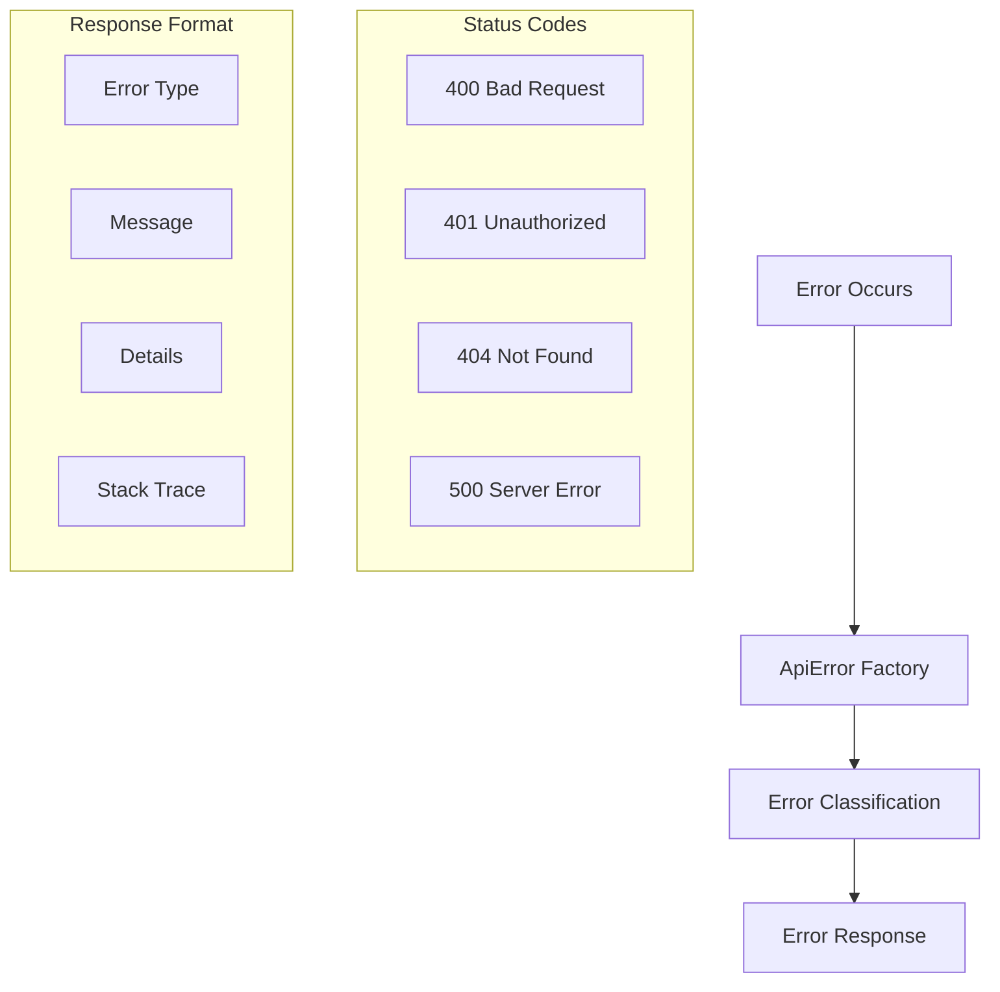
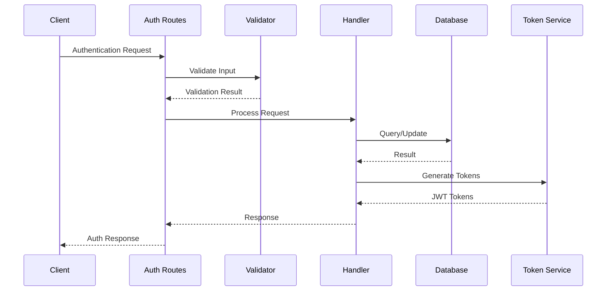

# Authentication System Architecture

## Overview

The authentication system implements a robust, multi-provider authentication solution with strong type safety and error handling.



## Key Components

### 1. Route Handlers

```mermaid
graph LR
    A[Auth Routes] --> B[/signup]
    A --> C[/login]
    A --> D[/google]
    A --> E[/refresh]
    A --> F[/logout]
```

- `/signup`: Email/password registration
- `/login`: Email/password authentication
- `/google`: Google OAuth authentication
- `/refresh`: Token refresh
- `/logout`: Session termination

### 2. Validation Layer



- Strong type inference from Zod schemas
- Detailed validation error messages
- Runtime type safety

### 3. Error Handling System



## Security Features

1. Password Security
   - Bcrypt hashing
   - Configurable salt rounds
   - Secure password validation

2. JWT Implementation
   - Secure token generation
   - Payload type safety
   - Token verification
   - Refresh token support

3. OAuth Security
   - Secure state management
   - Token validation
   - Scope verification

## Data Flow



## Development and Testing

### Local Setup
1. Configure environment variables in `.dev.vars`
2. Run migrations using `wrangler d1 migrations apply`
3. Start server with `wrangler dev`

### Testing Endpoints
```bash
# Signup
curl -X POST http://localhost:8787/auth/signup \
  -H "Content-Type: application/json" \
  -d '{"email":"test@example.com","password":"password123","name":"Test User"}'

# Login
curl -X POST http://localhost:8787/auth/login \
  -H "Content-Type: application/json" \
  -d '{"email":"test@example.com","password":"password123"}'
```

## Error Handling Strategy

1. Input Validation
   - Schema-based validation
   - Detailed error messages
   - Type-safe error responses

2. Runtime Errors
   - Standardized error format
   - Environment-aware error details
   - Comprehensive error logging

3. Authentication Errors
   - Clear error messages
   - Secure error responses
   - No sensitive data exposure

## Future Improvements

1. Password Recovery Flow
   - Email verification
   - Secure reset tokens
   - Rate limiting

2. Enhanced Security
   - 2FA support
   - Session management
   - IP-based rate limiting

3. OAuth Enhancements
   - Additional providers
   - Improved state management
   - Enhanced profile sync
