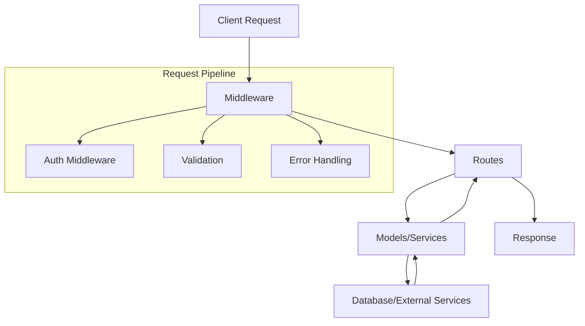
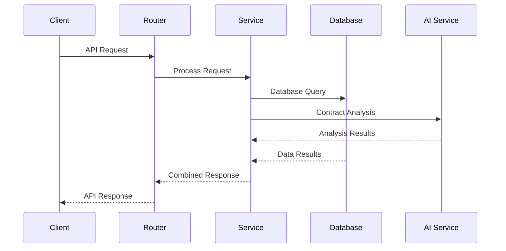

# Backend Source Directory

## Overview
This directory contains the core backend implementation for the AIContractCheck application. Built using TypeScript and Hono, it provides API endpoints for contract analysis, authentication, and user management.

## Key Components

### Core Modules
```
src/
├── middleware/    # Request middleware (auth, validation)
├── models/       # Data models and database operations
├── routes/       # API route handlers
├── services/     # Business logic and external services
├── types/        # TypeScript type definitions
└── utils/        # Utility functions
```

## Architecture

### Request Flow


### Service Architecture


## Implementation Details

### Application Setup
```typescript
import { Hono } from "hono";
import { cors } from "hono/cors";
import { authMiddleware } from "./middleware/auth";

const app = new Hono();

app.use("*", cors());
app.use("/api/*", authMiddleware);

// Route registration
app.route("/api/auth", authRouter);
app.route("/api/contracts", contractsRouter);
```

### Environment Types
```typescript
interface Env {
  DATABASE_URL: string;
  JWT_SECRET: string;
  AI_API_KEY: string;
}

declare module "hono" {
  interface Context {
    env: Env;
    user?: User;
  }
}
```

## Key Features

### Authentication
- JWT-based authentication
- Secure password hashing
- Token refresh mechanism
- Session management

### Contract Analysis
- File upload handling
- AI-powered analysis
- Result caching
- Version control

### Data Management
- SQL database integration
- Data validation
- Query optimization
- Transaction handling

## API Structure

### Authentication Endpoints
```typescript
router.post("/login", async (c) => {
  const { email, password } = await c.req.json();
  return await loginUser(c, email, password);
});

router.post("/logout", async (c) => {
  return await logoutUser(c);
});
```

### Contract Endpoints
```typescript
router.post("/analyze", async (c) => {
  const file = await c.req.file();
  return await analyzeContract(c, file);
});

router.get("/analysis/:id", async (c) => {
  return await getAnalysis(c);
});
```

## Error Handling

### Global Error Handler
```typescript
app.onError((err, c) => {
  if (err instanceof ValidationError) {
    return c.json({ error: err.message }, 400);
  }
  
  console.error("Server error:", err);
  return c.json({ error: "Internal server error" }, 500);
});
```

## Development Guidelines

### Best Practices
1. Follow RESTful API design
2. Implement proper error handling
3. Use TypeScript for type safety
4. Document API endpoints
5. Write unit tests
6. Handle async operations properly

### Security Considerations
- Input validation
- SQL injection prevention
- XSS protection
- Rate limiting
- Data encryption

## Related Documentation
- [API Documentation](/docs/api-auth.md)
- [Database Schema](/docs/database.md)
- [Security Guidelines](/docs/security.md)
