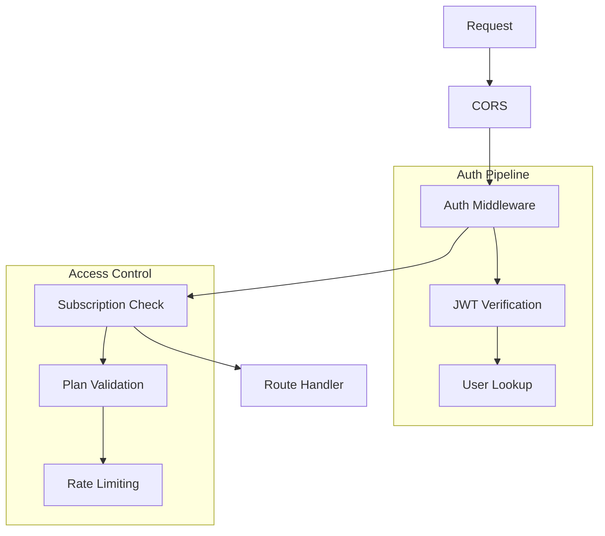
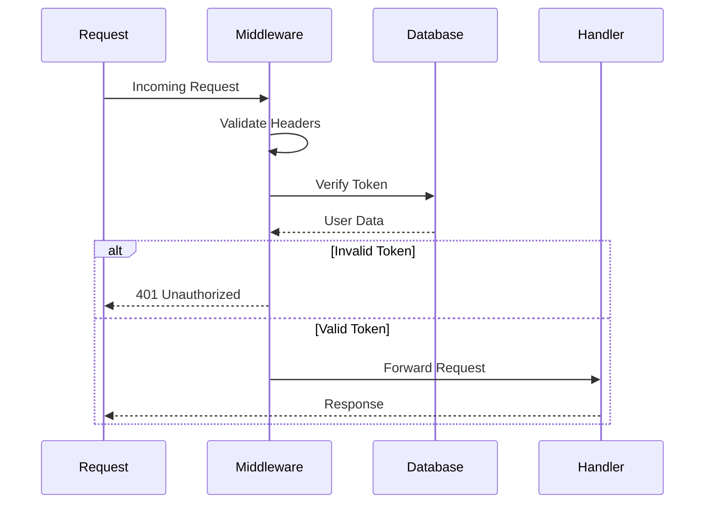

# Middleware

## Overview
This directory contains middleware functions for the AIContractCheck backend application. These middleware components handle authentication, request validation, and other cross-cutting concerns.

## Key Components

### Authentication Middleware
Handles JWT verification and user authentication.

```typescript
import { authMiddleware } from "./auth";

// Usage in main app
app.use("/api/*", authMiddleware);
```

### Subscription Middleware
Manages user subscription status and access control.

```typescript
import { subscriptionMiddleware } from "./subscription";

// Usage in protected routes
app.use("/api/premium/*", subscriptionMiddleware);
```

## Architecture

### Middleware Flow


### Request Processing


## Implementation Details

### Auth Middleware
```typescript
import { verify } from "../utils/jwt";
import { getUserById } from "../models/users";

export const authMiddleware = async (
  c: Context,
  next: Next
): Promise<Response | void> => {
  const token = c.req.header("Authorization")?.split(" ")[1];
  
  if (!token) {
    return c.json({ error: "Unauthorized" }, 401);
  }

  try {
    const payload = verify(token);
    const user = await getUserById(c, payload.sub);
    c.set("user", user);
    return next();
  } catch (error) {
    return c.json({ error: "Invalid token" }, 401);
  }
};
```

### Error Handling
```typescript
const errorMiddleware = async (
  err: Error,
  c: Context,
  next: Next
): Promise<Response | void> => {
  console.error("Middleware error:", err);
  
  if (err instanceof ValidationError) {
    return c.json({ error: err.message }, 400);
  }
  
  return c.json({ error: "Internal server error" }, 500);
};
```

## Usage Guidelines

### Best Practices
1. Keep middleware focused and single-responsibility
2. Handle errors appropriately
3. Maintain type safety
4. Consider performance impact
5. Log relevant information

### Error Handling Example
```typescript
try {
  // Middleware logic
  await next();
} catch (error) {
  if (error instanceof TokenExpiredError) {
    return c.json({ error: "Token expired" }, 401);
  }
  throw error; // Let global error handler deal with it
}
```

### Security Considerations
- Token validation
- Header sanitization
- Request validation
- Rate limiting
- Error information hiding

### Performance Tips
- Minimize database queries
- Use caching where appropriate
- Keep processing lightweight
- Handle async operations properly

## Related Documentation
- [Authentication Flow](/docs/auth-architecture.md)
- [API Security](/docs/security.md)
- [Error Handling](/docs/error-handling.md)
