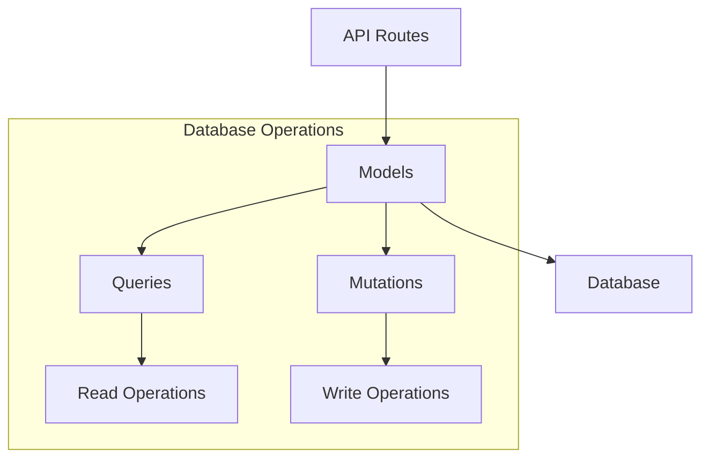
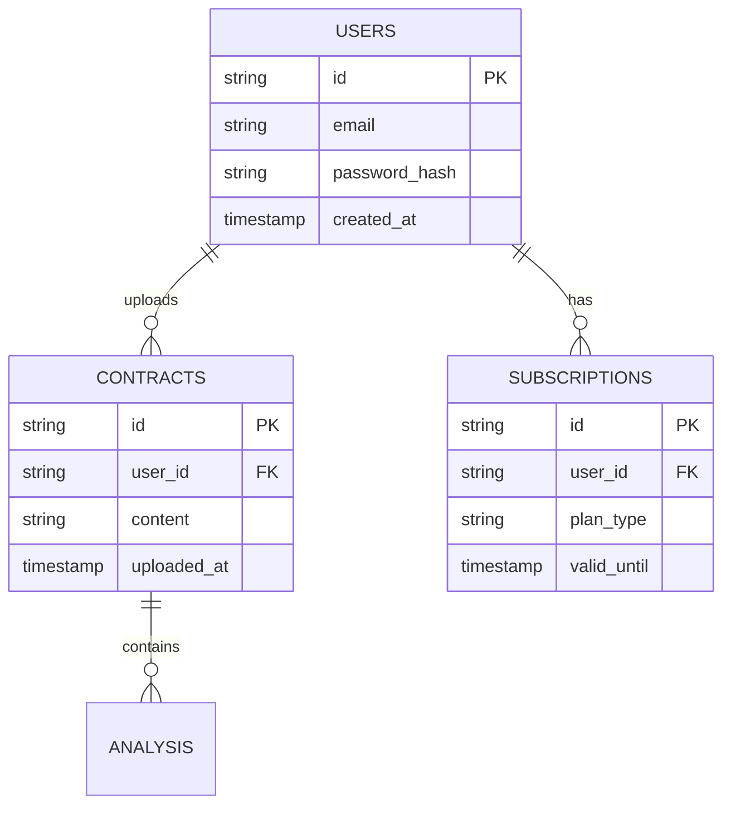

# Models

## Overview
This directory contains data models and database operations for the AIContractCheck application. The models define the structure of our data and provide methods for interacting with the database.

## Key Components

### Data Models
- `contracts.ts`: Contract analysis and management
- `users.ts`: User accounts and authentication
- `subscriptions.ts`: Subscription plans and billing
- `types.ts`: Shared TypeScript interfaces

## Architecture

### Data Flow


### Database Relationships


## Implementation Details

### User Model
```typescript
interface User {
  id: string;
  email: string;
  passwordHash: string;
  createdAt: Date;
}

export const getUserById = async (c: Context, id: string): Promise<User> => {
  const user = await c.env.DB.prepare(
    "SELECT * FROM users WHERE id = ?"
  ).bind(id).first();
  
  if (!user) throw new Error("User not found");
  return user as User;
};
```

### Contract Model
```typescript
interface Contract {
  id: string;
  userId: string;
  content: string;
  uploadedAt: Date;
}

export const createContract = async (
  c: Context,
  userId: string,
  content: string
): Promise<Contract> => {
  const id = generateId();
  await c.env.DB.prepare(
    "INSERT INTO contracts (id, user_id, content) VALUES (?, ?, ?)"
  ).bind(id, userId, content).run();
  
  return getContractById(c, id);
};
```

## Database Operations

### Query Patterns
```typescript
// Example of a complex query with joins
const getContractWithAnalysis = async (
  c: Context,
  contractId: string
): Promise<ContractWithAnalysis> => {
  return await c.env.DB.prepare(`
    SELECT 
      c.*,
      a.result as analysis_result
    FROM contracts c
    LEFT JOIN analysis a ON a.contract_id = c.id
    WHERE c.id = ?
  `).bind(contractId).first();
};
```

### Transaction Handling
```typescript
const createUserWithSubscription = async (
  c: Context,
  userData: NewUser,
  planType: string
): Promise<User> => {
  const tx = c.env.DB.tx();
  try {
    const user = await createUser(tx, userData);
    await createSubscription(tx, user.id, planType);
    await tx.commit();
    return user;
  } catch (error) {
    await tx.rollback();
    throw error;
  }
};
```

## Usage Guidelines

### Best Practices
1. Use prepared statements
2. Implement proper error handling
3. Maintain type safety
4. Use transactions when needed
5. Keep queries optimized

### Error Handling
```typescript
try {
  const result = await queryDatabase();
  if (!result) {
    throw new NotFoundError("Resource not found");
  }
  return result;
} catch (error) {
  if (error instanceof DatabaseError) {
    // Handle database errors
  }
  throw error;
}
```

### Performance Tips
- Index frequently queried fields
- Batch related operations
- Use appropriate data types
- Keep queries simple
- Cache when possible

## Related Documentation
- [Database Schema](/docs/database.md)
- [Data Models](/docs/models.md)
- [Query Optimization](/docs/performance.md)
