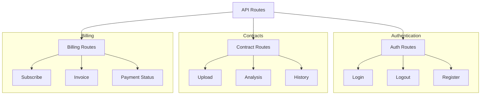
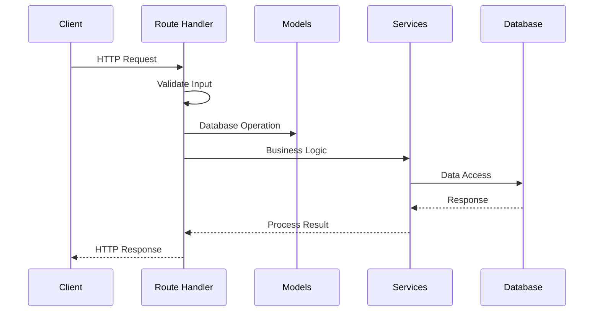

# Routes

## Overview
This directory contains API route handlers for the AIContractCheck application. These routes define the application's RESTful API endpoints and handle incoming HTTP requests.

## Key Components

### Route Modules
- `auth.ts`: Authentication endpoints
- `contracts.ts`: Contract upload and analysis
- `billing.ts`: Payment and subscription management

## Architecture

### Route Organization


### Request Flow


## Implementation Details

### Authentication Routes
```typescript
import { Hono } from "hono";
import { loginUser, logoutUser } from "../models/users";

const router = new Hono();

router.post("/login", async (c) => {
  const { email, password } = await c.req.json();
  return await loginUser(c, email, password);
});

router.post("/logout", async (c) => {
  return await logoutUser(c);
});
```

### Contract Routes
```typescript
router.post("/analyze", async (c) => {
  // Upload and analyze contract
  const file = await c.req.file();
  const userId = c.get("user").id;
  
  try {
    const analysis = await analyzeContract(c, file, userId);
    return c.json(analysis);
  } catch (error) {
    return handleError(c, error);
  }
});
```

## API Documentation

### Authentication Endpoints

#### POST /api/auth/login
```typescript
interface LoginRequest {
  email: string;
  password: string;
}

interface LoginResponse {
  token: string;
  user: User;
}
```

#### POST /api/auth/logout
```typescript
// Requires Authorization header
// Returns 200 OK on success
```

### Contract Endpoints

#### POST /api/contracts/analyze
```typescript
// Multipart form data with contract file
// Returns analysis results
interface AnalysisResponse {
  id: string;
  status: "completed" | "processing";
  results?: AnalysisResults;
}
```

## Error Handling

### Standard Error Response
```typescript
interface ErrorResponse {
  error: string;
  code: string;
  details?: any;
}

const handleError = (c: Context, error: any) => {
  if (error instanceof ValidationError) {
    return c.json({ 
      error: "Validation Error",
      code: "VALIDATION_ERROR",
      details: error.details
    }, 400);
  }
  
  return c.json({
    error: "Internal Server Error",
    code: "INTERNAL_ERROR"
  }, 500);
};
```

## Usage Guidelines

### Best Practices
1. Validate request inputs
2. Use appropriate HTTP methods
3. Handle errors consistently
4. Document API responses
5. Maintain versioning
6. Implement rate limiting

### Security Considerations
- Input validation
- Authentication checks
- CORS configuration
- Rate limiting
- Request size limits

### Performance Tips
- Optimize query params
- Use appropriate caching
- Handle async operations
- Monitor response times
- Implement pagination

## Related Documentation
- [API Documentation](/docs/api-auth.md)
- [Error Handling](/docs/error-handling.md)
- [Security Guidelines](/docs/security.md)
