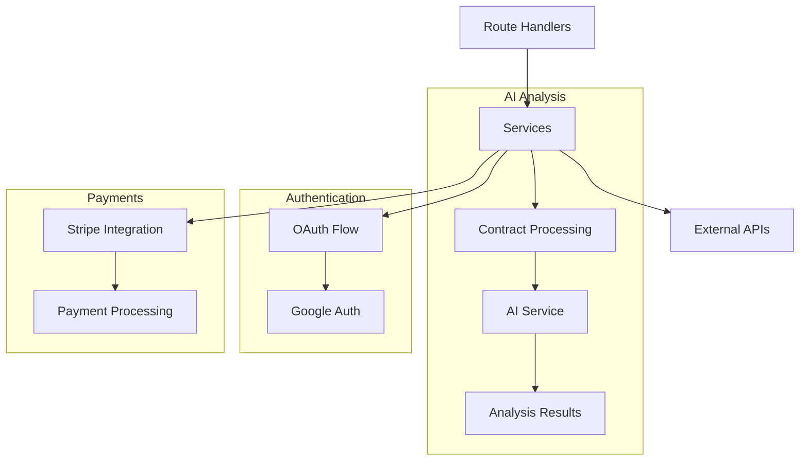
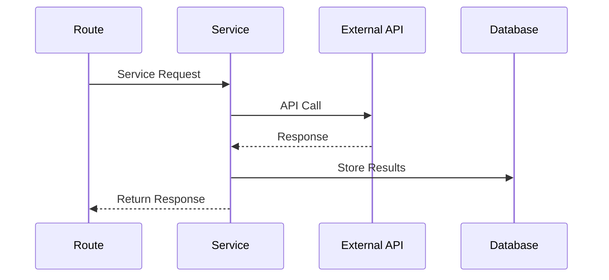

# Services

## Overview
This directory contains service modules that handle business logic and external service integrations for the AIContractCheck application. These services provide core functionality like AI-powered contract analysis and third-party integrations.

## Key Components

### Core Services
- `ai.ts`: AI contract analysis integration
- `google.ts`: Google OAuth integration
- `stripe.ts`: Payment processing
- `prompts/`: AI analysis prompts

## Architecture

### Service Flow


### Integration Flow


## Implementation Details

### AI Service
```typescript
import { analyzeContract } from "./ai";

export const processContract = async (
  content: string,
  options: AnalysisOptions
): Promise<Analysis> => {
  try {
    const analysis = await analyzeContract(content);
    return {
      summary: analysis.summary,
      risks: analysis.risks,
      recommendations: analysis.recommendations
    };
  } catch (error) {
    handleAnalysisError(error);
  }
};
```

### Payment Integration
```typescript
import Stripe from "stripe";

export const createSubscription = async (
  customerId: string,
  priceId: string
): Promise<Stripe.Subscription> => {
  const stripe = new Stripe(process.env.STRIPE_SECRET_KEY);
  
  return await stripe.subscriptions.create({
    customer: customerId,
    items: [{ price: priceId }],
    payment_behavior: "default_incomplete"
  });
};
```

## Service Configurations

### AI Configuration
```typescript
interface AIConfig {
  model: string;
  temperature: number;
  maxTokens: number;
}

const defaultConfig: AIConfig = {
  model: "gpt-4",
  temperature: 0.3,
  maxTokens: 2000
};
```

### OAuth Settings
```typescript
interface OAuthConfig {
  clientId: string;
  clientSecret: string;
  redirectUri: string;
  scopes: string[];
}
```

## Error Handling

### Service Errors
```typescript
class ServiceError extends Error {
  constructor(
    message: string,
    public code: string,
    public details?: any
  ) {
    super(message);
  }
}

const handleServiceError = (error: any) => {
  if (error instanceof ServiceError) {
    // Handle known service errors
    return error;
  }
  
  // Handle unknown errors
  throw new ServiceError(
    "Service unavailable",
    "SERVICE_ERROR"
  );
};
```

## Usage Guidelines

### Best Practices
1. Handle API rate limits
2. Implement retry logic
3. Cache responses when possible
4. Log service operations
5. Monitor performance

### Error Management
- Handle API timeouts
- Implement circuit breakers
- Validate responses
- Handle rate limiting
- Log error details

### Performance Optimization
- Batch operations
- Cache results
- Use async/await
- Handle concurrency
- Monitor memory usage

## Service Status Management
```typescript
interface ServiceStatus {
  status: "operational" | "degraded" | "down";
  lastCheck: Date;
  errors?: Error[];
}

const monitorService = async (
  service: Service
): Promise<ServiceStatus> => {
  // Implementation
};
```

## Related Documentation
- [AI Documentation](/docs/ai-integration.md)
- [OAuth Setup](/docs/oauth-setup.md)
- [Payment Integration](/docs/payments.md)
