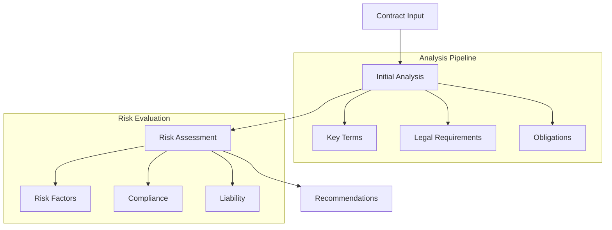
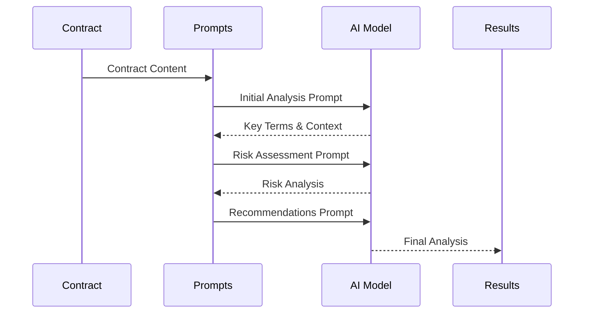

# AI Analysis Prompts

## Overview
This directory contains prompt templates and configurations used for AI-powered contract analysis in the AIContractCheck application. These prompts guide the AI model in analyzing legal documents and providing actionable insights.

## Key Components

### Prompt Templates
- `contract-analysis.ts`: Core contract analysis prompts

## Architecture

### Prompt Flow


### Analysis Process


## Implementation Details

### Prompt Structure
```typescript
interface AnalysisPrompt {
  context: string;
  instruction: string;
  examples: Example[];
  format: OutputFormat;
}

const contractAnalysisPrompt: AnalysisPrompt = {
  context: `You are a legal expert analyzing a contract...`,
  instruction: `Analyze the following contract...`,
  examples: [
    {
      input: "Sample contract text...",
      output: "Sample analysis..."
    }
  ],
  format: {
    structure: "json",
    fields: ["summary", "risks", "recommendations"]
  }
};
```

### Analysis Configuration
```typescript
interface PromptConfig {
  temperature: number;
  maxTokens: number;
  stopSequences: string[];
}

const defaultConfig: PromptConfig = {
  temperature: 0.3,
  maxTokens: 2000,
  stopSequences: ["###"]
};
```

## Prompt Categories

### Initial Analysis
```typescript
const initialAnalysisPrompt = `
Analyze this contract focusing on:
1. Key terms and definitions
2. Core obligations
3. Legal requirements
4. Critical dates and deadlines
`;
```

### Risk Assessment
```typescript
const riskAssessmentPrompt = `
Evaluate potential risks including:
1. Ambiguous terms
2. Missing clauses
3. Compliance issues
4. Liability exposure
`;
```

### Recommendations
```typescript
const recommendationsPrompt = `
Provide actionable recommendations for:
1. Risk mitigation
2. Clause improvements
3. Additional protections
4. Compliance measures
`;
```

## Usage Guidelines

### Best Practices
1. Keep prompts clear and specific
2. Include relevant context
3. Provide example outputs
4. Specify output format
5. Handle edge cases

### Optimization Tips
- Balance detail vs. conciseness
- Use consistent terminology
- Include validation rules
- Maintain version control
- Test thoroughly

### Performance Considerations
- Token optimization
- Response time
- Cost efficiency
- Quality assurance
- Model selection

## Related Documentation
- [AI Integration](/docs/ai-integration.md)
- [Analysis Pipeline](/docs/analysis.md)
- [Prompt Engineering](/docs/prompts.md)
