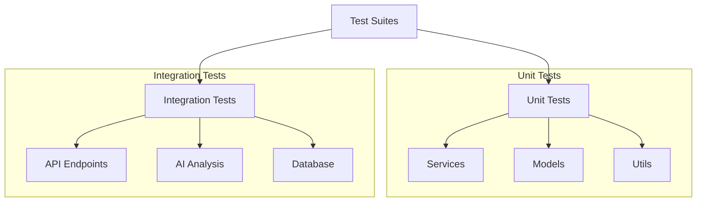
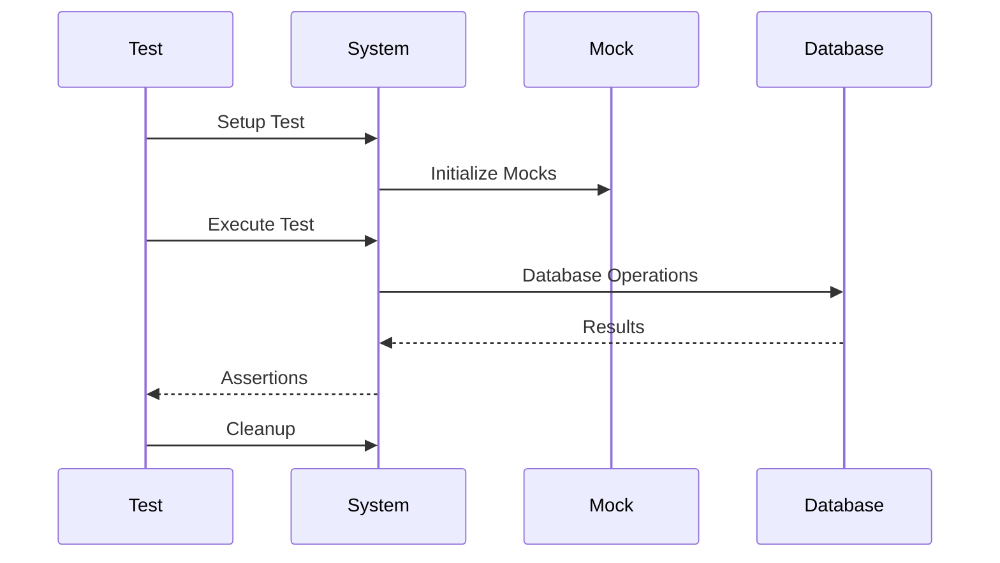

# Tests Directory

## Overview
This directory contains test suites for the AIContractCheck backend application. The tests ensure reliability and correctness of core functionality, particularly focusing on contract analysis and API endpoints.

## Key Components

### Test Suites
- `ai/analysis.test.ts`: Contract analysis tests
- `ai/test-contracts.ts`: Test contract data
- `setup.ts`: Test environment configuration

## Architecture

### Test Structure


### Test Flow


## Implementation Details

### Test Setup
```typescript
import { setup, teardown } from "./setup";

describe("Contract Analysis", () => {
  beforeAll(async () => {
    await setup();
  });

  afterAll(async () => {
    await teardown();
  });

  test("analyzes contract correctly", async () => {
    // Test implementation
  });
});
```

### Mock Data
```typescript
// Test contract data
export const testContracts = {
  basic: {
    content: "Sample contract content...",
    expectedAnalysis: {
      risks: ["Risk 1", "Risk 2"],
      recommendations: ["Rec 1", "Rec 2"]
    }
  }
};
```

## Test Categories

### Unit Tests

#### Service Tests
```typescript
describe("AI Service", () => {
  test("processes contract text", async () => {
    const result = await analyzeContract(testContracts.basic.content);
    expect(result.risks).toEqual(
      testContracts.basic.expectedAnalysis.risks
    );
  });
});
```

#### Model Tests
```typescript
describe("User Model", () => {
  test("creates user", async () => {
    const user = await createUser(testData.validUser);
    expect(user.email).toBe(testData.validUser.email);
  });
});
```

### Integration Tests

#### API Tests
```typescript
describe("Contract API", () => {
  test("uploads and analyzes contract", async () => {
    const response = await request(app)
      .post("/api/contracts/analyze")
      .attach("contract", testFile);
    
    expect(response.status).toBe(200);
    expect(response.body).toHaveProperty("analysis");
  });
});
```

## Usage Guidelines

### Best Practices
1. Write descriptive test names
2. Maintain isolated test cases
3. Use appropriate assertions
4. Handle async operations
5. Clean up after tests

### Test Organization
```typescript
describe("Feature", () => {
  describe("Scenario", () => {
    test("should behave as expected", () => {
      // Test implementation
    });
  });
});
```

### Mock Guidelines
- Keep mocks simple
- Mock external services
- Use realistic test data
- Clean up mock data
- Document mock behavior

### Performance Tips
- Group related tests
- Optimize setup/teardown
- Use test databases
- Cache when appropriate
- Parallel test execution

## Related Documentation
- [Test Guidelines](/docs/testing.md)
- [Mock Data](/docs/test-data.md)
- [CI/CD Integration](/docs/ci-cd.md)
