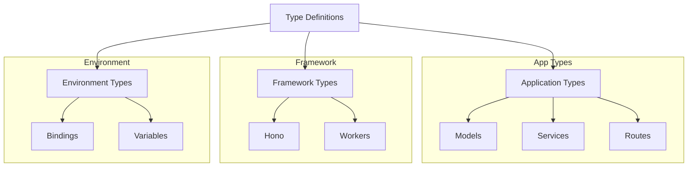
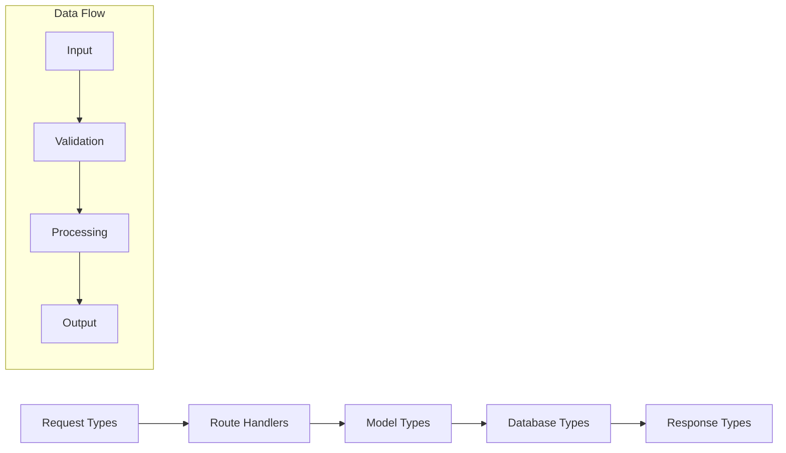

# Types Directory

## Overview
This directory contains TypeScript type definitions for the AIContractCheck backend application. These types ensure type safety and provide clear interfaces for data structures and API contracts.

## Key Components

### Type Definitions
- `app.d.ts`: Application-wide type definitions
- `bindings.d.ts`: Environment binding types
- `env.d.ts`: Environment variable types
- `hono.d.ts`: Hono framework type extensions
- `worker.d.ts`: Cloudflare Worker types

## Architecture

### Type Organization


### Type Relationships


## Implementation Details

### Environment Types
```typescript
interface Env {
  DATABASE_URL: string;
  JWT_SECRET: string;
  AI_API_KEY: string;
  ENVIRONMENT: "development" | "production";
}

interface Bindings {
  DB: D1Database;
  KV: KVNamespace;
  AI: AIService;
}
```

### Application Types
```typescript
interface User {
  id: string;
  email: string;
  createdAt: Date;
}

interface Contract {
  id: string;
  userId: string;
  content: string;
  analysis?: Analysis;
}

interface Analysis {
  summary: string;
  risks: Risk[];
  recommendations: string[];
}
```

### API Types
```typescript
interface ApiResponse<T> {
  success: boolean;
  data?: T;
  error?: {
    code: string;
    message: string;
  };
}

interface PaginatedResponse<T> {
  items: T[];
  total: number;
  page: number;
  pageSize: number;
}
```

## Usage Guidelines

### Best Practices
1. Use descriptive type names
2. Maintain strict type boundaries
3. Document complex types
4. Use type composition
5. Keep types DRY

### Type Organization
```typescript
// Group related types
namespace Auth {
  export interface Credentials {
    email: string;
    password: string;
  }

  export interface Token {
    token: string;
    expiresAt: Date;
  }
}
```

### Type Extensions
```typescript
// Extend existing types
declare module "hono" {
  interface Context {
    user: User;
    env: Env;
  }
}
```

### Type Guards
```typescript
function isUser(obj: any): obj is User {
  return (
    typeof obj === "object" &&
    typeof obj.id === "string" &&
    typeof obj.email === "string"
  );
}
```

## Type Utilities

### Generic Types
```typescript
type Nullable<T> = T | null;
type Optional<T> = T | undefined;
type AsyncResult<T> = Promise<Result<T, Error>>;

interface Result<T, E> {
  success: boolean;
  data?: T;
  error?: E;
}
```

### Helper Types
```typescript
type DeepPartial<T> = {
  [P in keyof T]?: T[P] extends object 
    ? DeepPartial<T[P]> 
    : T[P];
};

type Pick<T, K extends keyof T> = {
  [P in K]: T[P];
};
```

## Related Documentation
- [TypeScript Guidelines](/docs/typescript.md)
- [API Types](/docs/api-types.md)
- [Type Safety](/docs/type-safety.md)
