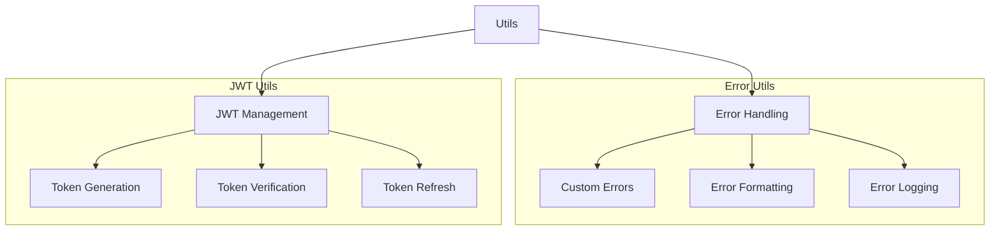
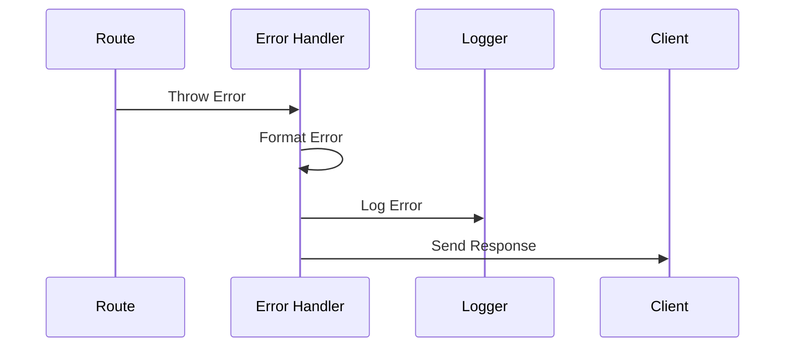

# Utils Directory

## Overview
This directory contains utility functions and helper modules used throughout the AIContractCheck backend application. These utilities provide common functionality for error handling, JWT operations, and other shared tasks.

## Key Components

### Utility Modules
- `errors.ts`: Error handling utilities
- `jwt.ts`: JWT token management functions

## Architecture

### Utility Organization


### Error Flow


## Implementation Details

### Error Handling
```typescript
export class AppError extends Error {
  constructor(
    message: string,
    public statusCode: number = 500,
    public code: string = "INTERNAL_ERROR"
  ) {
    super(message);
    this.name = "AppError";
  }
}

export const handleError = (error: unknown): ApiResponse => {
  if (error instanceof AppError) {
    return {
      success: false,
      error: {
        code: error.code,
        message: error.message
      }
    };
  }
  
  // Handle unknown errors
  return {
    success: false,
    error: {
      code: "INTERNAL_ERROR",
      message: "An unexpected error occurred"
    }
  };
};
```

### JWT Utilities
```typescript
import { sign, verify } from "jsonwebtoken";

export const generateToken = (
  payload: JWTPayload,
  secret: string,
  options?: JWTOptions
): string => {
  return sign(payload, secret, {
    expiresIn: "24h",
    ...options
  });
};

export const verifyToken = (
  token: string,
  secret: string
): JWTPayload => {
  try {
    return verify(token, secret) as JWTPayload;
  } catch (error) {
    throw new AppError(
      "Invalid token",
      401,
      "INVALID_TOKEN"
    );
  }
};
```

## Usage Examples

### Error Handling
```typescript
try {
  // Operation that might fail
  throw new AppError("Resource not found", 404, "NOT_FOUND");
} catch (error) {
  const response = handleError(error);
  return c.json(response, response.error?.statusCode || 500);
}
```

### JWT Operations
```typescript
// Generate token
const token = generateToken(
  { userId: user.id },
  process.env.JWT_SECRET
);

// Verify token
try {
  const payload = verifyToken(token, process.env.JWT_SECRET);
  // Use payload data
} catch (error) {
  // Handle invalid token
}
```

## Best Practices

### Error Management
1. Use custom error classes
2. Include error codes
3. Implement proper logging
4. Handle async errors
5. Maintain consistent format

### JWT Security
- Set appropriate expiry times
- Use strong secrets
- Implement refresh tokens
- Include necessary claims
- Validate token payload

### Code Organization
```typescript
// Group related utilities
export namespace Security {
  export function hash(data: string): string {
    // Implementation
  }

  export function verify(data: string, hash: string): boolean {
    // Implementation
  }
}
```

## Performance Tips
- Cache computation results
- Optimize error handling
- Use efficient algorithms
- Minimize dependencies
- Handle async operations

## Related Documentation
- [Error Handling](/docs/error-handling.md)
- [Security Guidelines](/docs/security.md)
- [JWT Documentation](/docs/jwt.md)
