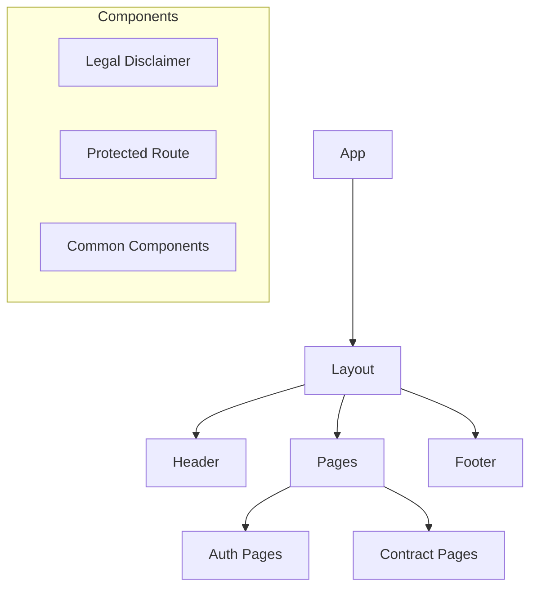
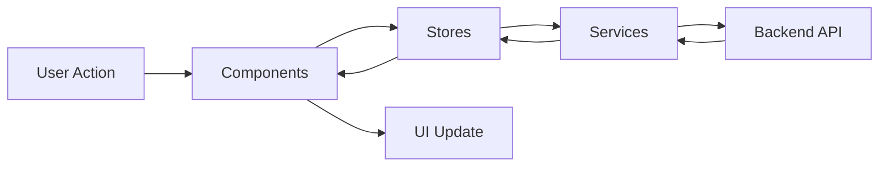
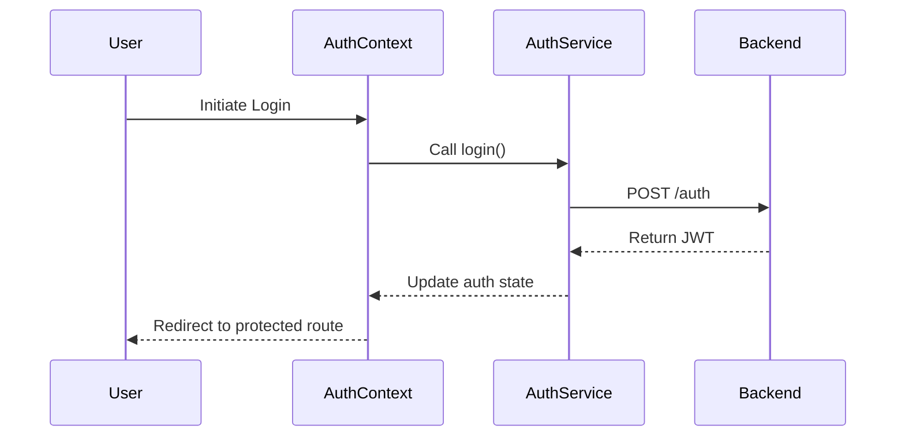

# Frontend Source Directory

## Overview
This directory contains the main source code for the AIContractCheck frontend application. The application is built using React with TypeScript and follows a modular architecture pattern. It focuses on contract analysis features with secure authentication.

## Key Components

### Directory Structure
```
src/
├── components/     # Reusable UI components
├── contexts/      # React context providers
├── pages/         # Page components and routes
├── services/      # API and external service integrations
├── stores/        # State management stores
└── types/         # TypeScript type definitions
```

### Core Modules
- **Authentication**: Managed through AuthContext and auth services
- **Contract Analysis**: File upload and analysis features with AI integration
- **Common Components**: Reusable UI elements and layout components

## Architecture Diagrams

### Component Hierarchy


### Data Flow


### Authentication Flow


## Key Features

### State Management
- Uses React Context for global state
- Zustand stores for specific feature states
- Persistent storage for user preferences

### API Integration
- Axios-based API client
- Type-safe API calls using shared types
- Automatic error handling and retry logic

### Routing
- Component-based routing structure
- Protected routes for authenticated content
- Dynamic route loading

## Usage Examples

### Protected Route Implementation
```typescript
import { ProtectedRoute } from "@/components/auth/ProtectedRoute";

const PrivatePage = () => (
  <ProtectedRoute>
    <YourComponent />
  </ProtectedRoute>
);
```

### API Service Usage
```typescript
import { api } from "@/services/api";

const fetchData = async () => {
  const response = await api.get("/endpoint");
  return response.data;
};
```

## Related Documentation
- [Authentication Architecture](/docs/auth-architecture.md)
- [Frontend Development Guide](../README.md)
- [API Documentation](/docs/api-auth.md)

## Development Guidelines
1. Follow established component structure
2. Use TypeScript for all new code
3. Implement error boundaries for component safety
4. Maintain consistent state management patterns
5. Document complex business logic
6. Write meaningful commit messages
