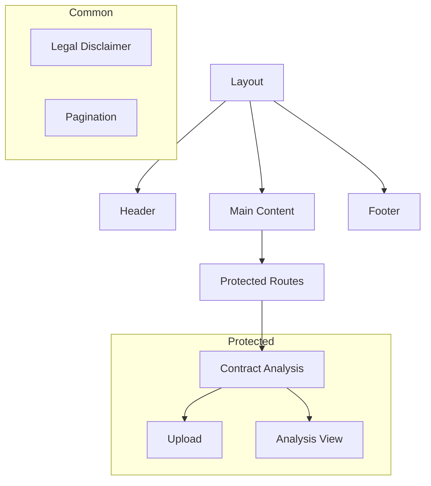
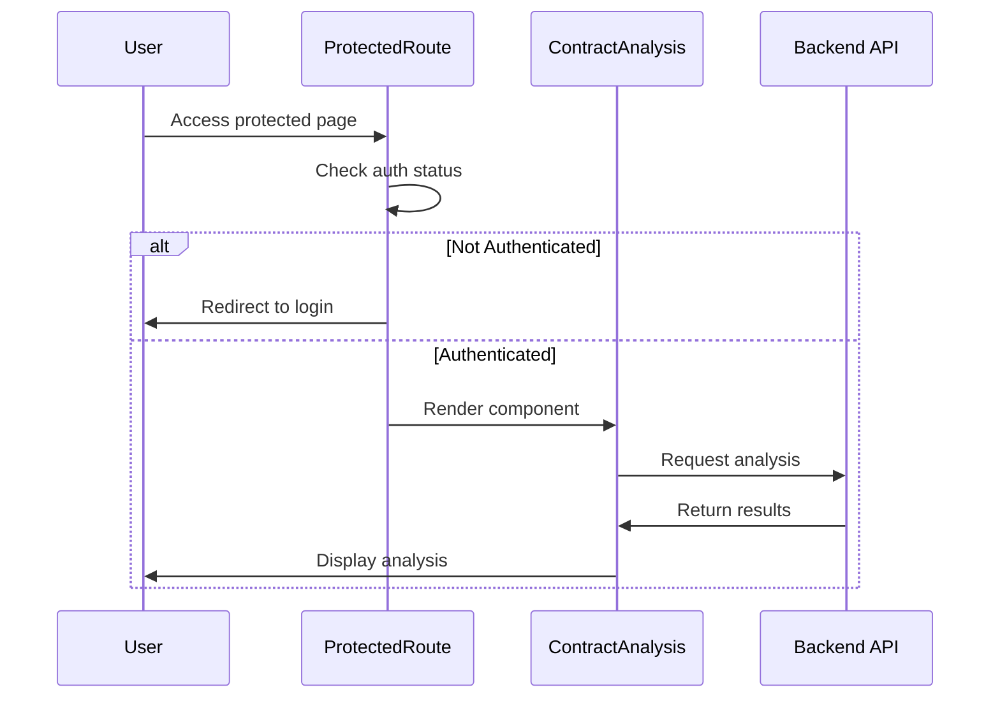

# Components Directory

## Overview
This directory contains all reusable React components used throughout the AIContractCheck application. Components are organized by feature and functionality, promoting code reuse and maintainability.

## Directory Structure
```
components/
├── auth/          # Authentication related components
├── common/        # Shared utility components
└── layout/        # Layout and structural components
```

## Key Components

### Authentication Components
- `ProtectedRoute`: Higher-order component for route protection
- Located in: `auth/ProtectedRoute.tsx`
- Usage: Wraps routes that require authentication

### Common Components
- `LegalDisclaimer`: Displays legal information and terms
- `Pagination`: Handles data pagination
- Located in: `common/`
- Usage: Shared across multiple features

### Layout Components
- `Header`: Main navigation and app header
- `Footer`: Application footer with links
- `Layout`: Main layout wrapper
- `MobileMenu`: Responsive navigation menu
- Located in: `layout/`
- Usage: Provides consistent structure across pages

## Component Architecture

### Component Relationships


### Component Flow


## Implementation Guidelines

### Component Structure
```typescript
// Standard component structure
import React from "react";
import type { ComponentProps } from "react";

interface Props extends ComponentProps<"div"> {
  // Component specific props
}

export const MyComponent: React.FC<Props> = ({ ...props }) => {
  return (
    <div {...props}>
      {/* Component content */}
    </div>
  );
};
```

### Best Practices
1. Keep components focused and single-responsibility
2. Use TypeScript for type safety
3. Implement error boundaries where appropriate
4. Follow accessibility guidelines
5. Include prop documentation
6. Write unit tests for complex components

### Error Handling
```typescript
try {
  // Component logic
} catch (error) {
  // Error handling
  console.error("Component error:", error);
  // Display user-friendly error message
}
```

## Related Documentation
- [Frontend Architecture](/docs/auth-architecture.md)
- [Component Testing Guidelines](../README.md)
- [Accessibility Standards](/docs/a11y.md)
