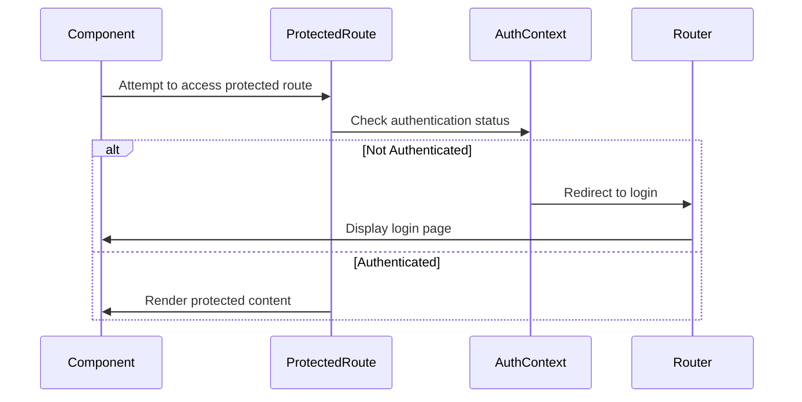
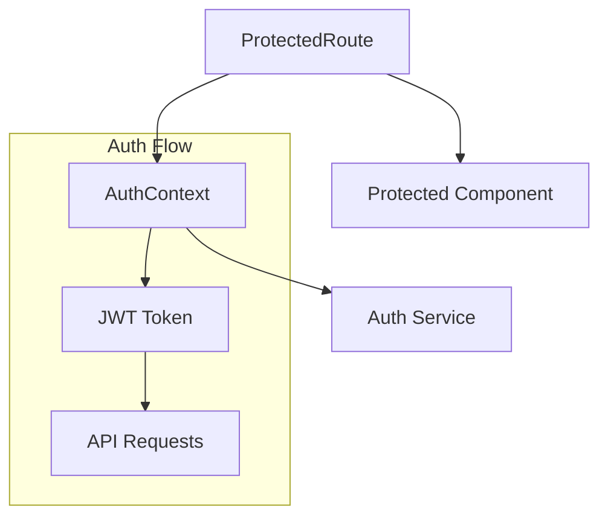

# Authentication Components

## Overview
This directory contains components responsible for handling authentication and authorization in the AIContractCheck application. These components ensure secure access to protected routes and manage user authentication states.

## Key Components

### ProtectedRoute Component
Primary component that wraps routes requiring authentication.

```typescript
import { ProtectedRoute } from "./ProtectedRoute";

// Usage example
<ProtectedRoute>
  <YourSecureComponent />
</ProtectedRoute>
```

## Component Architecture

### Authentication Flow


### Component Integration


## Implementation Details

### Protected Route Implementation
```typescript
// ProtectedRoute.tsx
import { useAuth } from "../../contexts/AuthContext";
import { Navigate } from "react-router-dom";

export const ProtectedRoute: React.FC<{
  children: React.ReactNode;
}> = ({ children }) => {
  const { isAuthenticated } = useAuth();

  if (!isAuthenticated) {
    return <Navigate to="/login" />;
  }

  return <>{children}</>;
};
```

### Key Features
1. **Automatic Redirection**: Redirects unauthenticated users to login
2. **Token Validation**: Validates JWT tokens
3. **Session Management**: Handles auth session lifecycle
4. **Secure Routing**: Protects sensitive routes
5. **Context Integration**: Uses AuthContext for state management

### Error Handling
- Handles expired tokens
- Manages authentication failures
- Provides user feedback for auth issues

## Usage Guidelines

### Protected Route Usage
1. Import the ProtectedRoute component
2. Wrap any component requiring authentication
3. Configure redirect paths if needed
4. Handle loading states appropriately

### Best Practices
1. Always use ProtectedRoute for sensitive content
2. Implement proper error boundaries
3. Handle token refresh scenarios
4. Maintain consistent authorization checks

## Related Documentation
- [Authentication Architecture](/docs/auth-architecture.md)
- [Auth Development Guide](/docs/auth-development.md)
- [API Authentication](/docs/api-auth.md)

## Security Considerations
1. Token storage security
2. XSS prevention
3. CSRF protection
4. Secure routing implementation
5. Session management
