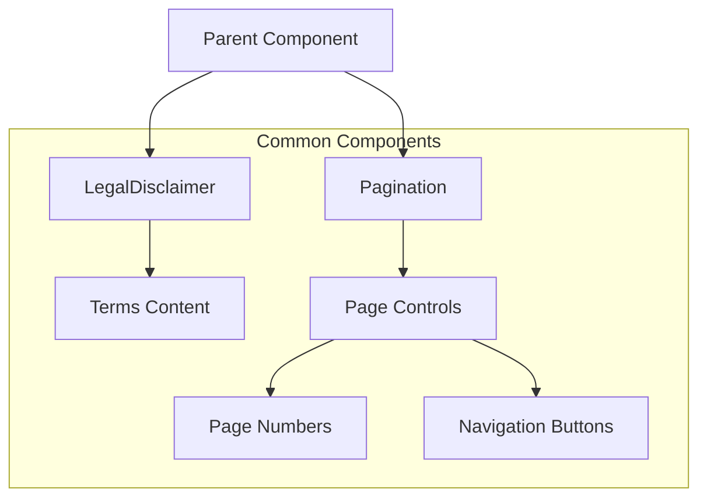
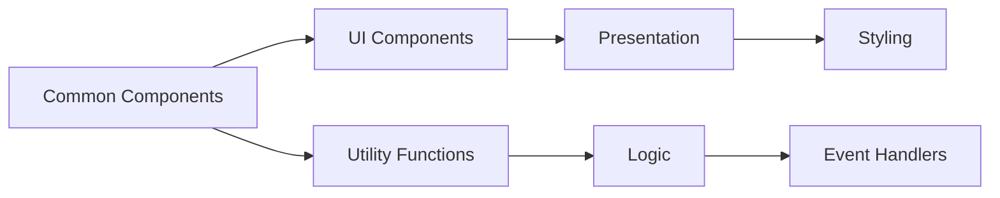

# Common Components

## Overview
This directory contains shared utility components used throughout the AIContractCheck application. These components provide consistent, reusable functionality across different features and pages.

## Key Components

### LegalDisclaimer
Displays legal information and terms of service.

```typescript
import { LegalDisclaimer } from "./LegalDisclaimer";

// Usage
<LegalDisclaimer />
```

### Pagination
Handles data pagination for lists and tables.

```typescript
import { Pagination } from "./Pagination";

// Usage
<Pagination
  currentPage={1}
  totalPages={10}
  onPageChange={(page) => handlePageChange(page)}
/>
```

## Component Architecture

### Component Relationships


### Component Structure


## Implementation Details

### LegalDisclaimer Component
```typescript
interface LegalDisclaimerProps {
  className?: string;
  customText?: string;
}

const LegalDisclaimer: React.FC<LegalDisclaimerProps> = ({
  className,
  customText
}) => {
  return (
    <div className={className}>
      {customText || defaultLegalText}
    </div>
  );
};
```

### Pagination Component
```typescript
interface PaginationProps {
  currentPage: number;
  totalPages: number;
  onPageChange: (page: number) => void;
}

const Pagination: React.FC<PaginationProps> = ({
  currentPage,
  totalPages,
  onPageChange
}) => {
  // Component implementation
};
```

## Usage Guidelines

### Best Practices
1. Keep components pure and predictable
2. Use TypeScript for type safety
3. Implement proper error handling
4. Follow accessibility guidelines
5. Maintain consistent styling

### Error Handling
```typescript
try {
  // Component operations
} catch (error) {
  console.error("Common component error:", error);
  // Display user-friendly error message
}
```

### Accessibility Features
- ARIA labels for interactive elements
- Keyboard navigation support
- Screen reader compatibility
- High contrast support
- Focus management

## Styling

### CSS Modules
- Use CSS modules for component-specific styles
- Follow BEM naming convention
- Maintain consistent theming
- Support responsive design

### Example
```typescript
import styles from "./Common.module.css";

const Component = () => (
  <div className={styles.container}>
    {/* Component content */}
  </div>
);
```

## Related Documentation
- [Component Guidelines](../README.md)
- [Accessibility Standards](/docs/accessibility.md)
- [Style Guide](/docs/style-guide.md)
