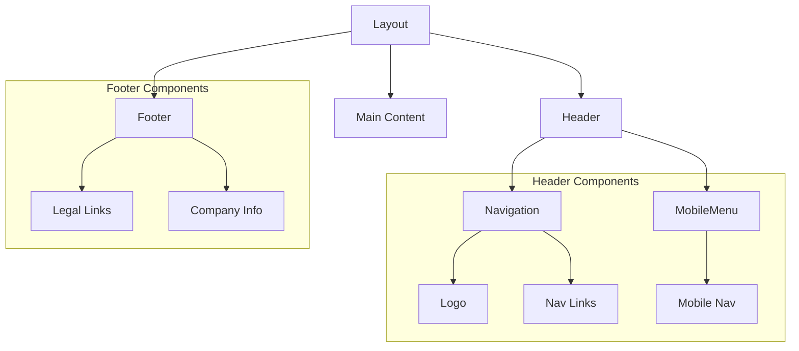
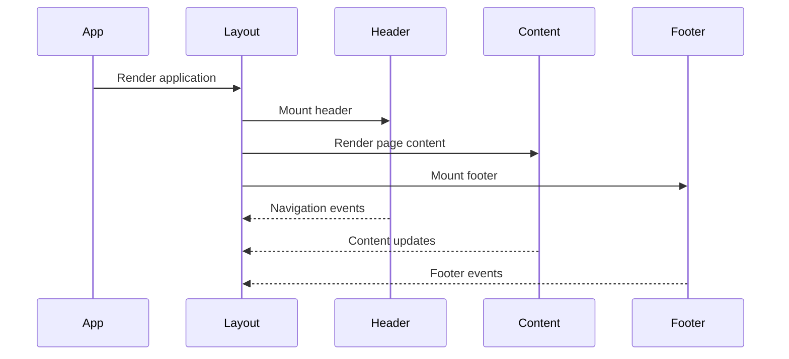
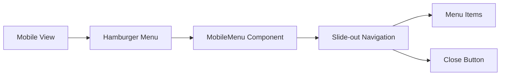

# Layout Components

## Overview
This directory contains the core layout components that provide the structural foundation for the AIContractCheck application. These components ensure consistent page structure and navigation across the application.

## Key Components

### Layout
Main layout wrapper component that provides the basic page structure.

```typescript
import { Layout } from "./Layout";

// Usage
<Layout>
  <YourPageContent />
</Layout>
```

### Header
Application header with navigation and branding.

```typescript
import { Header } from "./Header";

// Usage
<Header />
```

### Footer
Application footer with legal information and links.

```typescript
import { Footer } from "./Footer";

// Usage
<Footer />
```

### MobileMenu
Responsive navigation menu for mobile devices.

```typescript
import { MobileMenu } from "./MobileMenu";

// Usage
<MobileMenu isOpen={isMenuOpen} onClose={handleClose} />
```

## Component Architecture

### Layout Structure


### Component Flow


## Implementation Details

### Layout Component
```typescript
interface LayoutProps {
  children: React.ReactNode;
}

const Layout: React.FC<LayoutProps> = ({ children }) => {
  return (
    <div className="min-h-screen flex flex-col">
      <Header />
      <main className="flex-grow">
        {children}
      </main>
      <Footer />
    </div>
  );
};
```

### Navigation Structure
```typescript
interface NavItem {
  label: string;
  path: string;
  protected?: boolean;
}

const navigationItems: NavItem[] = [
  { label: "Home", path: "/" },
  { label: "Contracts", path: "/contracts", protected: true },
  { label: "About", path: "/about" }
];
```

## Responsive Design

### Breakpoints
- Mobile: < 768px
- Tablet: 768px - 1024px
- Desktop: > 1024px

### Mobile Navigation


## Usage Guidelines

### Best Practices
1. Always wrap page content with Layout
2. Handle responsive states appropriately
3. Maintain consistent navigation structure
4. Consider accessibility in navigation
5. Implement proper error boundaries

### Error Handling
```typescript
try {
  // Layout operations
} catch (error) {
  console.error("Layout error:", error);
  // Fallback to basic layout
}
```

### Accessibility Features
- Skip to main content link
- ARIA landmarks
- Keyboard navigation
- Focus management
- Screen reader support

## Related Documentation
- [Component Guidelines](../README.md)
- [Responsive Design Guide](/docs/responsive.md)
- [Navigation Architecture](/docs/navigation.md)
