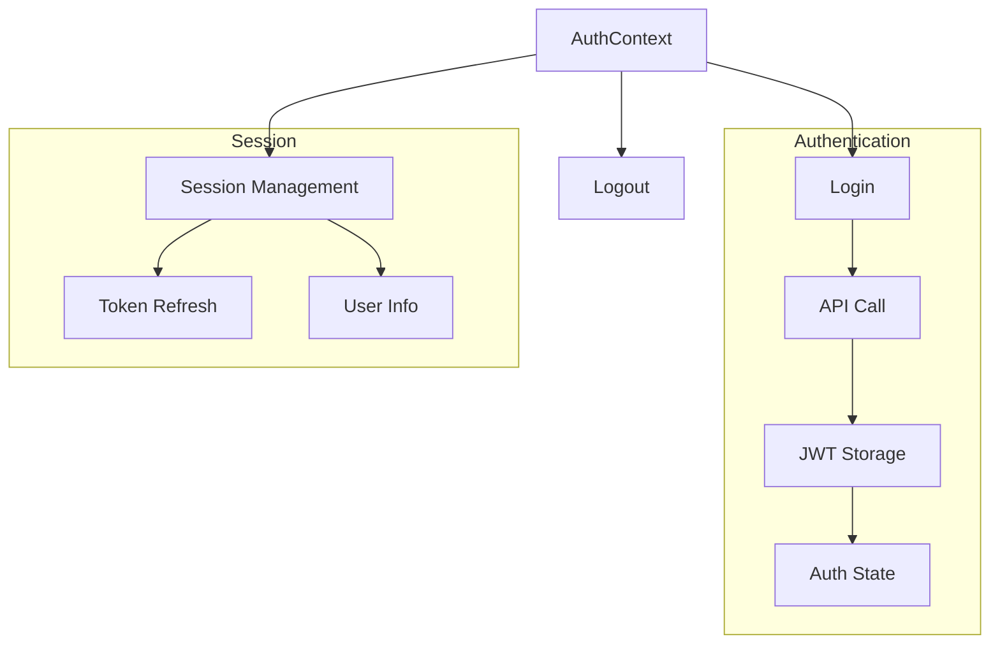
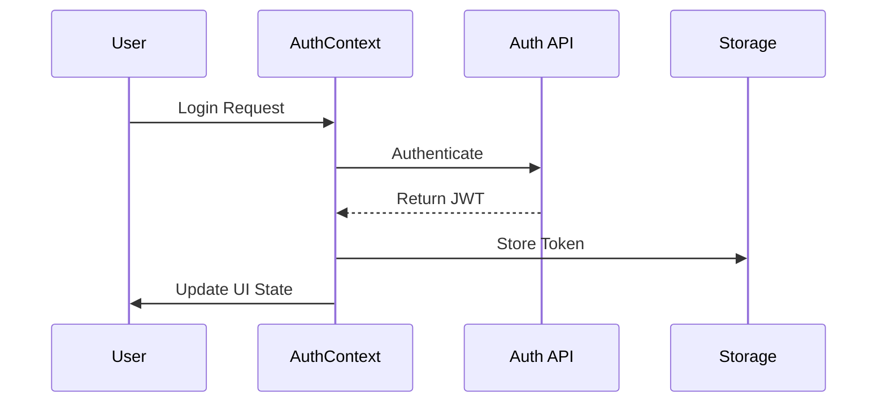

# Contexts

## Overview
This directory contains React Context providers that manage global state throughout the AIContractCheck application. The contexts handle authentication state and other application-wide data management needs.

## Key Components

### AuthContext
Manages authentication state and user session information.

```typescript
import { AuthProvider, useAuth } from "./AuthContext";

// Provider usage
<AuthProvider>
  <App />
</AuthProvider>

// Hook usage
const { isAuthenticated, user, login, logout } = useAuth();
```

## Context Architecture

### State Management Flow


### Authorization Flow


## Implementation Details

### AuthContext Implementation
```typescript
interface AuthContextType {
  isAuthenticated: boolean;
  user: User | null;
  login: (credentials: LoginCredentials) => Promise<void>;
  logout: () => void;
}

const AuthContext = createContext<AuthContextType>(null!);

export const AuthProvider: React.FC<{ children: React.ReactNode }> = ({ children }) => {
  const [user, setUser] = useState<User | null>(null);
  const [isAuthenticated, setIsAuthenticated] = useState(false);

  // Implementation details
  return (
    <AuthContext.Provider value={{ isAuthenticated, user, login, logout }}>
      {children}
    </AuthContext.Provider>
  );
};
```

### Token Management
```typescript
const handleLogin = async (credentials: LoginCredentials) => {
  try {
    const response = await api.post("/auth/login", credentials);
    const { token, user } = response.data;
    
    // Store token securely
    localStorage.setItem("auth_token", token);
    setUser(user);
    setIsAuthenticated(true);
  } catch (error) {
    handleAuthError(error);
  }
};
```

## Usage Guidelines

### Best Practices
1. Always use the `useAuth` hook for authentication state
2. Handle loading and error states appropriately
3. Implement proper token refresh mechanism
4. Secure token storage
5. Clean up on logout

### Error Handling
```typescript
const handleAuthError = (error: any) => {
  // Clear invalid auth state
  setUser(null);
  setIsAuthenticated(false);
  localStorage.removeItem("auth_token");
  
  // Handle specific error cases
  if (error.response?.status === 401) {
    // Handle unauthorized
  } else if (error.response?.status === 403) {
    // Handle forbidden
  }
};
```

### Security Considerations
- Token storage security
- XSS prevention
- CSRF protection
- Token refresh strategies
- Session management

## Related Documentation
- [Authentication Architecture](/docs/auth-architecture.md)
- [Security Guidelines](/docs/security.md)
- [API Documentation](/docs/api-auth.md)
