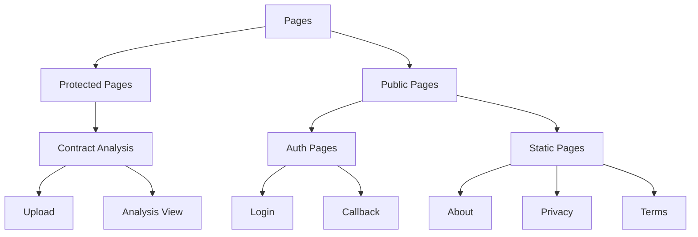
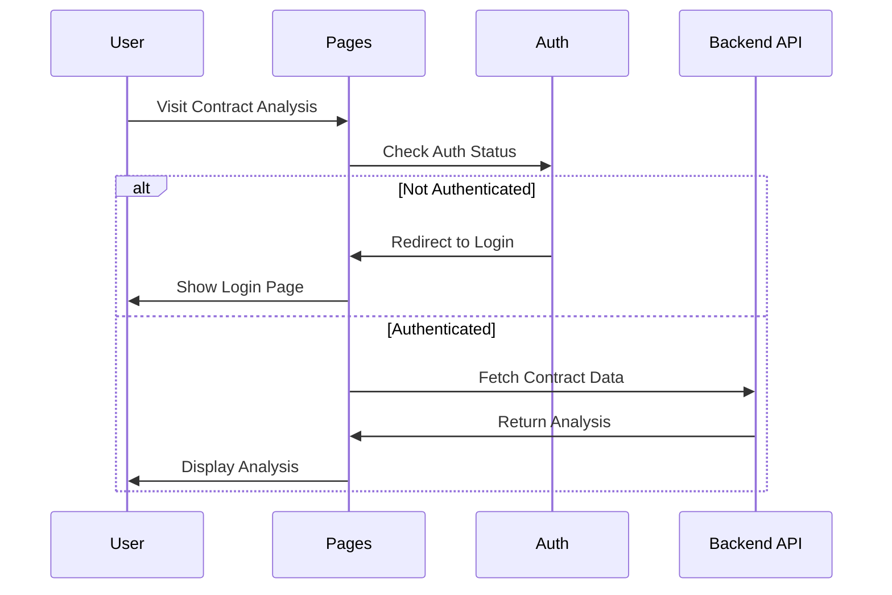

# Pages

## Overview
This directory contains the main page components for the AIContractCheck application. Each page represents a distinct view or feature accessible through the application's routing system.

## Key Pages

### Contract Analysis Pages
Located in `contracts/`:
- `AnalysisPage`: Main contract analysis interface
- `UploadPage`: Contract upload and submission

### Authentication Pages
Located in `auth/`:
- `Login`: User authentication page
- `Callback`: OAuth callback handler

### Static Pages
- `About`: Application information
- `Privacy`: Privacy policy
- `Terms`: Terms of service

## Page Architecture

### Page Organization


### Page Flow


## Implementation Details

### Contract Analysis Page
```typescript
import { useAuth } from "@/contexts/AuthContext";
import { api } from "@/services/api";

const AnalysisPage: React.FC = () => {
  const { user } = useAuth();
  const [analysis, setAnalysis] = useState<Analysis | null>(null);

  // Implementation details
  return (
    <div>
      <h1>Contract Analysis</h1>
      {/* Analysis content */}
    </div>
  );
};
```

### Route Protection
```typescript
// Example of protected route setup
const routes = [
  {
    path: "/contracts/*",
    element: (
      <ProtectedRoute>
        <ContractRoutes />
      </ProtectedRoute>
    )
  }
];
```

## Features

### Contract Analysis
- File upload interface
- Analysis processing
- Results display
- Revision history

### Authentication
- Login form
- OAuth integration
- Session management
- Protected routes

### Static Content
- Legal information
- Application documentation
- User guides

## Usage Guidelines

### Best Practices
1. Implement proper loading states
2. Handle errors gracefully
3. Maintain consistent layouts
4. Follow accessibility guidelines
5. Use type-safe components

### Error Handling
```typescript
const handleError = (error: any) => {
  if (error.response?.status === 404) {
    // Handle not found
    return <NotFound />;
  }
  // Handle other errors
  return <ErrorDisplay error={error} />;
};
```

### Performance Considerations
- Implement code splitting
- Optimize data fetching
- Cache responses
- Lazy load components
- Minimize bundle size

## Related Documentation
- [Routing Architecture](/docs/routing.md)
- [Authentication Flow](/docs/auth-architecture.md)
- [Contract Analysis](/docs/contract-analysis.md)
