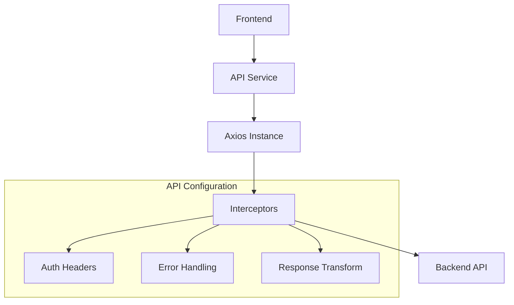
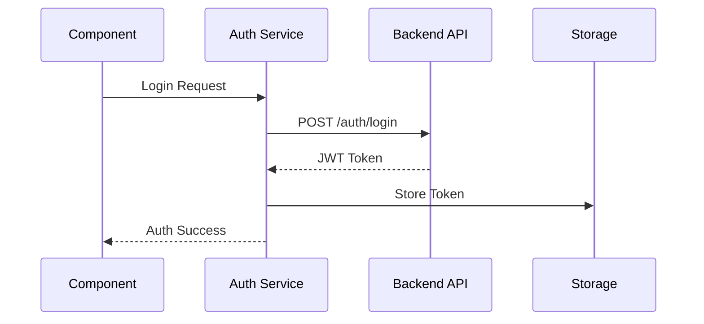

# Services

## Overview
This directory contains service modules that handle external API communication and integrate with third-party services for the AIContractCheck application.

## Key Services

### API Service
Core API communication service with axios instance configuration.

```typescript
import { api } from "./api";

// Usage example
const response = await api.get("/endpoint");
```

### Auth Service
Handles authentication-related API calls and token management.

```typescript
import { login, logout } from "./auth";

// Usage example
await login(credentials);
```

## Service Architecture

### API Flow


### Authentication Flow


## Implementation Details

### API Service Configuration
```typescript
import axios from "axios";

const api = axios.create({
  baseURL: process.env.API_BASE_URL,
  headers: {
    "Content-Type": "application/json"
  }
});

// Request interceptor
api.interceptors.request.use((config) => {
  const token = localStorage.getItem("auth_token");
  if (token) {
    config.headers.Authorization = `Bearer ${token}`;
  }
  return config;
});

// Response interceptor
api.interceptors.response.use(
  (response) => response,
  (error) => handleApiError(error)
);
```

### Error Handling
```typescript
const handleApiError = (error: any) => {
  if (error.response?.status === 401) {
    // Handle unauthorized
    logout();
  }
  return Promise.reject(error);
};
```

## Service Types

### API Response Types
```typescript
interface ApiResponse<T> {
  data: T;
  status: number;
  message: string;
}

interface ErrorResponse {
  error: string;
  message: string;
  status: number;
}
```

## Usage Guidelines

### Best Practices
1. Use type-safe requests and responses
2. Implement proper error handling
3. Handle token refresh logic
4. Cache responses when appropriate
5. Follow API rate limits

### Error Management
```typescript
try {
  const response = await api.get("/endpoint");
  // Handle success
} catch (error) {
  if (error.response) {
    // Handle HTTP error
    handleHttpError(error.response);
  } else if (error.request) {
    // Handle network error
    handleNetworkError(error.request);
  } else {
    // Handle other errors
    handleGenericError(error);
  }
}
```

### Security Considerations
- Secure token storage
- Request/response encryption
- CSRF protection
- Rate limiting
- Data validation

## Related Documentation
- [API Documentation](/docs/api-auth.md)
- [Authentication Flow](/docs/auth-architecture.md)
- [Error Handling Guidelines](/docs/error-handling.md)
