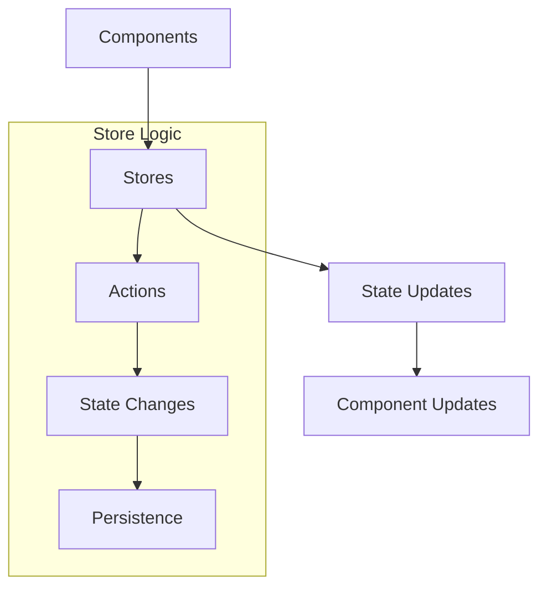
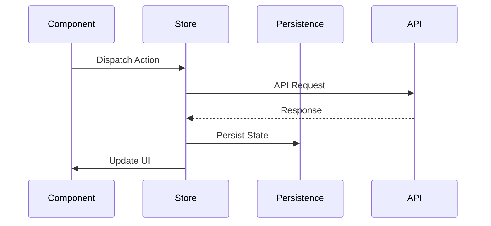

# Stores

## Overview
This directory contains Zustand stores that manage application state for the AIContractCheck application. These stores provide a simple and performant way to handle global state management.

## Key Stores

### Auth Store
Manages authentication state and user information.

```typescript
import { useAuthStore } from "./auth";

// Usage example
const { user, isAuthenticated } = useAuthStore();
```

## Store Architecture

### State Management Flow


### Data Flow


## Implementation Details

### Store Creation
```typescript
import create from "zustand";
import { persist } from "zustand/middleware";

interface AuthState {
  user: User | null;
  isAuthenticated: boolean;
  login: (credentials: Credentials) => Promise<void>;
  logout: () => void;
}

export const useAuthStore = create<AuthState>()(
  persist(
    (set) => ({
      user: null,
      isAuthenticated: false,
      login: async (credentials) => {
        // Implementation
        set({ user, isAuthenticated: true });
      },
      logout: () => set({ user: null, isAuthenticated: false })
    }),
    {
      name: "auth-storage"
    }
  )
);
```

### Store Types
```typescript
interface User {
  id: string;
  email: string;
  // Other user properties
}

interface Credentials {
  email: string;
  password: string;
}
```

## Usage Guidelines

### Best Practices
1. Keep stores focused and minimal
2. Use TypeScript for type safety
3. Implement proper error handling
4. Consider persistence needs
5. Maintain atomic updates

### Error Handling
```typescript
const handleStoreError = (error: any) => {
  console.error("Store error:", error);
  // Clean up store state if needed
  set({ error: error.message });
};
```

### State Updates
```typescript
// Example of an atomic update
const updateUser = (userData: Partial<User>) => 
  set((state) => ({
    user: { ...state.user, ...userData }
  }));
```

### Store Integration
```typescript
// Component usage
function UserProfile() {
  const { user, updateUser } = useAuthStore();

  return (
    <div>
      <h1>{user.name}</h1>
      <button onClick={() => updateUser({ name: "New Name" })}>
        Update Name
      </button>
    </div>
  );
}
```

### Performance Considerations
- Use selectors for optimal re-renders
- Split stores by domain/feature
- Implement shallow equality checks
- Avoid nested state when possible

## Store Middleware

### Persistence
```typescript
import { persist } from "zustand/middleware";

const useStore = create(
  persist(
    (set) => ({
      // Store implementation
    }),
    {
      name: "store-key",
      getStorage: () => localStorage
    }
  )
);
```

## Related Documentation
- [State Management Guide](/docs/state-management.md)
- [Store Patterns](/docs/store-patterns.md)
- [Performance Optimization](/docs/performance.md)
