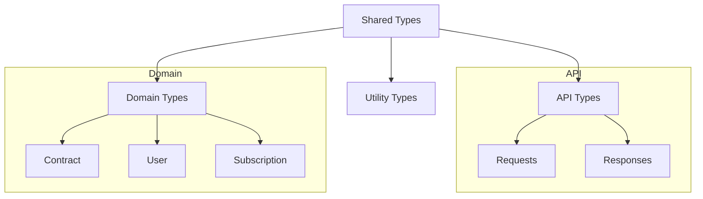
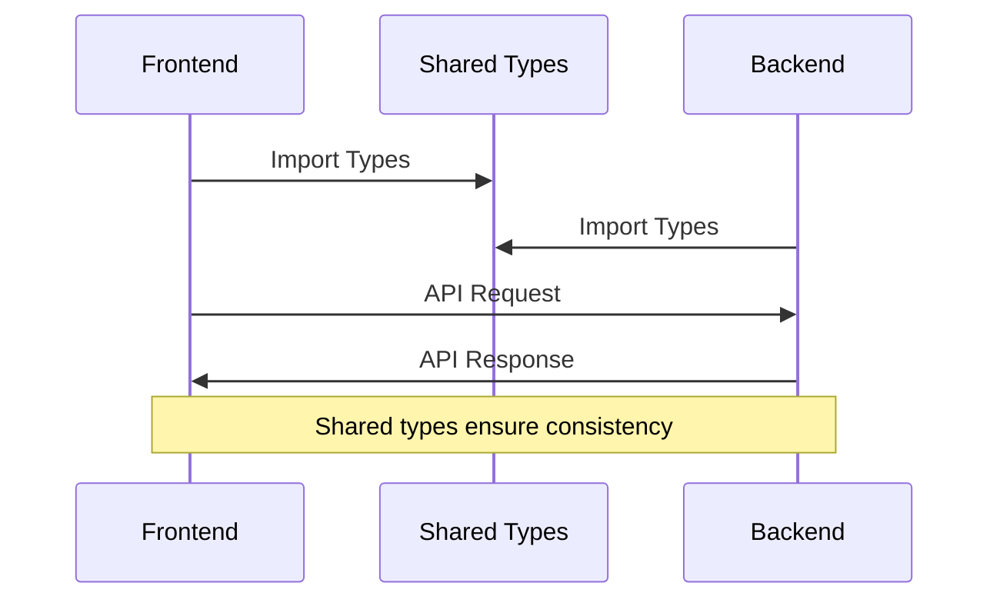

# Shared Source Directory

## Overview
This directory contains shared code and types used across both frontend and backend parts of the AIContractCheck application. It ensures consistency in data structures and type definitions throughout the application.

## Key Components

### Shared Types
Located in `types/`:
- `api.ts`: API request/response types
- `auth.ts`: Authentication types
- `contract.ts`: Contract data structures
- `subscription.ts`: Subscription types

## Architecture

### Type Organization


### Type Usage Flow


## Implementation Details

### API Types
```typescript
export interface ApiRequest<T = any> {
  params?: Record<string, string>;
  query?: Record<string, string>;
  body?: T;
}

export interface ApiResponse<T = any> {
  success: boolean;
  data?: T;
  error?: {
    code: string;
    message: string;
  };
}
```

### Contract Types
```typescript
export interface Contract {
  id: string;
  title: string;
  content: string;
  analysis?: ContractAnalysis;
}

export interface ContractAnalysis {
  summary: string;
  risks: Risk[];
  recommendations: string[];
}
```

### Auth Types
```typescript
export interface User {
  id: string;
  email: string;
  createdAt: Date;
}

export interface AuthTokens {
  accessToken: string;
  refreshToken: string;
}
```

## Usage Guidelines

### Best Practices
1. Keep types simple and focused
2. Use descriptive names
3. Document complex types
4. Follow naming conventions
5. Maintain backward compatibility

### Type Composition
```typescript
// Combine types for specific use cases
type ContractUpload = Pick<Contract, "title" | "content">;
type ContractSummary = Pick<Contract, "id" | "title" | "analysis">;

// Extend base types
interface DetailedContract extends Contract {
  metadata: {
    uploadedBy: string;
    uploadedAt: Date;
  };
}
```

### Type Guards
```typescript
export function isContract(obj: unknown): obj is Contract {
  return (
    typeof obj === "object" &&
    obj !== null &&
    "id" in obj &&
    "content" in obj
  );
}
```

## Type Documentation

### Using JSDoc
```typescript
/**
 * Represents a contract analysis request.
 * @property {string} contractId - The ID of the contract to analyze
 * @property {AnalysisOptions} options - Analysis configuration options
 */
export interface AnalysisRequest {
  contractId: string;
  options: AnalysisOptions;
}
```

### Type Examples
```typescript
// Example usage documentation
const contract: Contract = {
  id: "123",
  title: "Sample Contract",
  content: "Contract content..."
};

const analysis: ContractAnalysis = {
  summary: "Contract summary",
  risks: [],
  recommendations: []
};
```

## Related Documentation
- [API Documentation](/docs/api-types.md)
- [Type Guidelines](/docs/type-guidelines.md)
- [Development Standards](/docs/standards.md)
