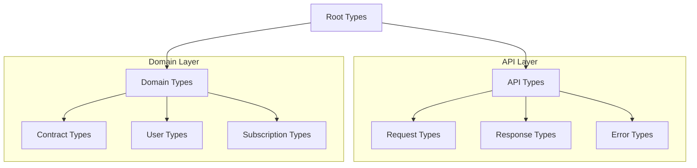
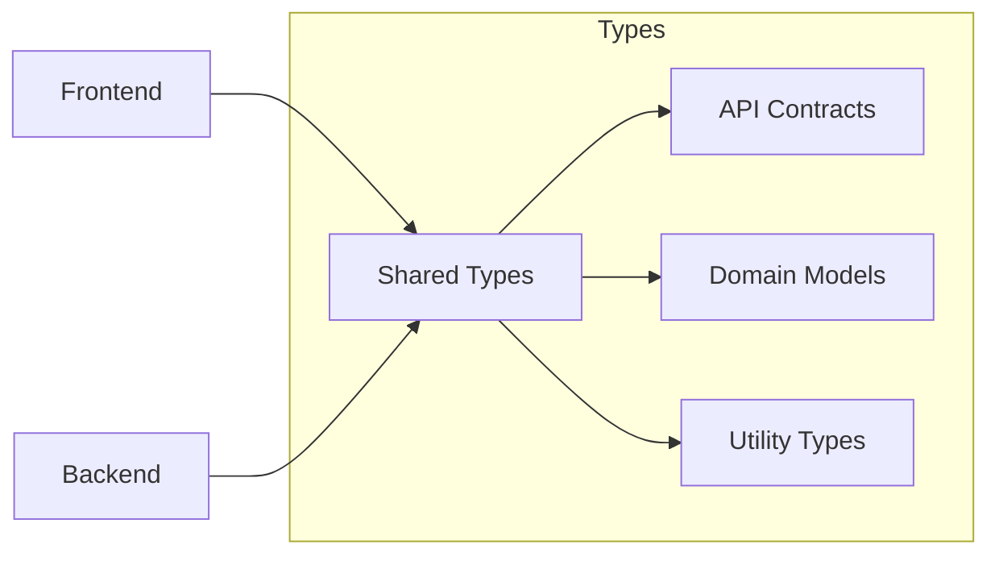

# Shared Types Directory

## Overview
This directory contains TypeScript type definitions shared between the frontend and backend of the AIContractCheck application. These types ensure consistency in data structures and API contracts across the entire application.

## Key Components

### Type Files
- `api.ts`: API request/response interfaces
- `auth.ts`: Authentication and user types
- `contract.ts`: Contract and analysis types
- `subscription.ts`: Subscription and billing types

## Architecture

### Type Hierarchy


### Type Dependencies


## Implementation Details

### API Contracts
```typescript
export namespace API {
  export interface Request<T = unknown> {
    body?: T;
    query?: Record<string, string>;
    headers?: Record<string, string>;
  }

  export interface Response<T = unknown> {
    data: T;
    status: number;
    message?: string;
  }
}
```

### Domain Types
```typescript
export interface Contract {
  id: string;
  content: string;
  analysis?: {
    summary: string;
    risks: string[];
    recommendations: string[];
  };
  metadata: {
    createdAt: Date;
    updatedAt: Date;
  };
}

export interface User {
  id: string;
  email: string;
  role: UserRole;
  subscription?: Subscription;
}
```

### Type Guards
```typescript
export const isValidContract = (obj: unknown): obj is Contract => {
  const contract = obj as Contract;
  return (
    typeof contract === "object" &&
    typeof contract.id === "string" &&
    typeof contract.content === "string"
  );
};
```

## Usage Guidelines

### Type Declaration
```typescript
// Use interfaces for extendable types
interface BaseResponse {
  success: boolean;
  timestamp: Date;
}

// Use type aliases for unions and intersections
type ApiResponse<T> = BaseResponse & {
  data?: T;
  error?: ErrorResponse;
};
```

### Best Practices
1. Keep types focused and single-purpose
2. Use descriptive type names
3. Document complex types
4. Maintain backwards compatibility
5. Use strict null checks

### Type Composition
```typescript
// Combining types
type UserWithoutPassword = Omit<User, "password">;
type PublicUser = Pick<User, "id" | "email" | "role">;

// Utility types
type Nullable<T> = T | null;
type Optional<T> = T | undefined;
```

### Error Types
```typescript
export interface ErrorResponse {
  code: ErrorCode;
  message: string;
  details?: Record<string, unknown>;
}

export enum ErrorCode {
  VALIDATION_ERROR = "VALIDATION_ERROR",
  NOT_FOUND = "NOT_FOUND",
  UNAUTHORIZED = "UNAUTHORIZED"
}
```

## Documentation

### JSDoc Usage
```typescript
/**
 * Represents a contract analysis result.
 * @template T - The type of the analysis data
 * @property {string} id - Unique identifier for the analysis
 * @property {T} data - Analysis result data
 * @property {Date} completedAt - When the analysis was completed
 */
export interface Analysis<T> {
  id: string;
  data: T;
  completedAt: Date;
}
```

## Related Documentation
- [Type System Overview](/docs/type-system.md)
- [API Contracts](/docs/api-contracts.md)
- [Type Guidelines](/docs/type-guidelines.md)
